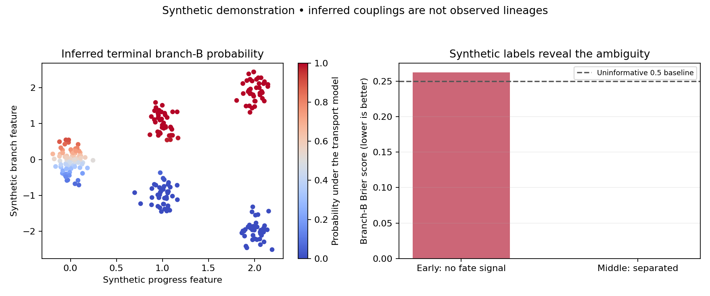

# Synthetic branching benchmark

240 synthetic cells, three independently sampled snapshots, seed 0.

The first snapshot deliberately contains **no information** about the hidden branch label.
The next two snapshots separate branches geometrically. This tests both a recoverable case
and a case where confident-looking transport assignments cannot establish fate.

| Snapshot | Branch-B Brier score ↓ | Constant 0.5 baseline ↓ | Accuracy |
|---|---:|---:|---:|
| 0 | 0.2626 | 0.2500 | 0.575 |
| 1 | 0.0001 | 0.2500 | 1.000 |

Terminal labels define the target, so their tautological fit is excluded from scoring.
This is a single synthetic seed, with no biological interpretation or confidence interval.
The earlier state labels are used only to score the fixture, never as transport features.

